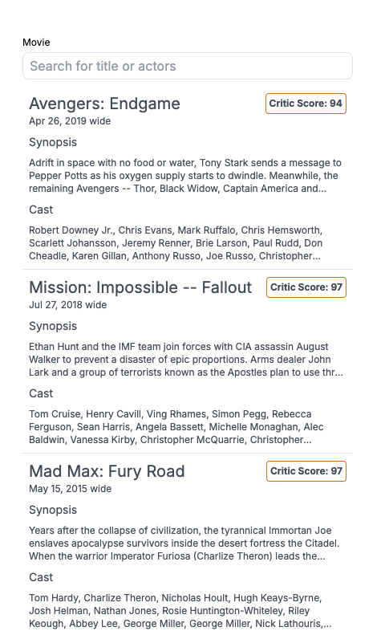

# Prueba técnica
¡Bienvenido 👋 a la prueba técnica de Formación Ninja! Esta evaluación integral pondrá a prueba tu destreza en el desarrollo de aplicaciones web modernas, desde el backend hasta el frontend, así como tu familiaridad con el flujo de trabajo de Git y GitHub.

🥅 **Objetivo:** Construir una aplicación web que interactúe con una base de datos de películas, proporcionando una interfaz de usuario para buscar y mostrar información detallada sobre cada película.

### Instrucciones de la prueba

1. **Clona el repositorio:**
    - Accede al repositorio de GitHub proporcionado.
    - Haz un fork del repositorio a tu cuenta personal de GitHub.
2. **Realiza commits continuos:**
    - A medida que avances en la prueba, realiza commits frecuentes y descriptivos en tu repositorio local.
    - Sube tus cambios a tu fork en GitHub periódicamente.
    - Esto nos permitirá seguir tu progreso y evaluar tu enfoque de desarrollo.

### Tareas a realizar

1. **Configuración de la base de datos:**
    - Utiliza el archivo `init.sql` para crear la estructura de la base de datos dentro de un contenedor Docker, aprovechando la configuración del archivo `docker-compose.yaml`.
2. **Desarrollo del backend con NestJS:**
    - Implementa un endpoint REST que responda con un JSON conteniendo la lista de películas almacenadas en la base de datos.

1. **Construcción del frontend con NextJS:**
    - Diseña una interfaz de usuario intuitiva que permita a los usuarios buscar películas por título y/o autor.
    - Muestra los resultados de la búsqueda en un listado claro y organizado, incluyendo los siguientes detalles para cada película:
        - Nombre
        - Fecha de estreno en cines
        - Puntuación de la crítica (Critic Score)
        - Sinopsis
        - Reparto (crew)

**Consideraciones importantes:**

- **Librerías:** Todas las librerías necesarias para completar la prueba ya están incluidas en el proyecto. **No está permitido instalar librerías adicionales.**
- **Enfoque:** Demuestra tu capacidad para escribir código limpio, eficiente y bien estructurado.
- **Creatividad:** ¡Siéntete libre de añadir toques personales a la interfaz de usuario para que destaque!
- **Control de versiones:** Utiliza Git y GitHub de manera efectiva para gestionar tu código y demostrar tu conocimiento de buenas prácticas de desarrollo.

**¡Buena suerte!** ¡Esperamos que disfrutes de la prueba!